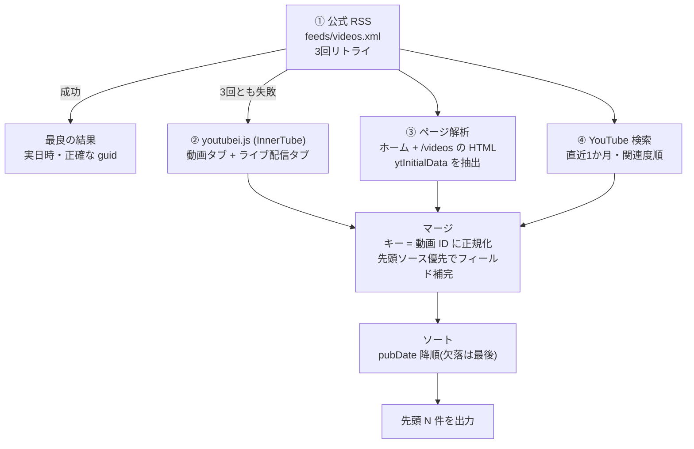

# YouTube 最新動画リスト取得の知見 — 公式 RSS とフォールバック

> 対象: `lib/routes/youtube-official/channel.ts`、`lib/routes/youtube/api/youtubei.ts`
> 最終更新: 2026-09-09(実機検証に基づく)

YouTube チャンネルの「最新動画リスト」を安定して取得するための知見をまとめる。
公式 RSS だけに頼ると断続的な障害で取得できなくなるため、複数ソースのフォールバック構成が必須。
この文書は、実装時にハマった落とし穴とその解決策を将来の保守のために記録したものである。

---

## 1. 全体アーキテクチャ



**設計原則**: ソースは「正確性の高い順」に並べ、マージ時に先頭ソースの値を優先する。
日時の正確さは ① > ② ≈ ③ > ④、タイトルの言語は ① ≈ ③ > ②(ロケール設定による)。

---

## 2. ソース① 公式 RSS(Atom)

### 基本情報

| 項目           | 内容                                                                             |
| -------------- | -------------------------------------------------------------------------------- |
| エンドポイント | `https://www.youtube.com/feeds/videos.xml?channel_id=UC...`                      |
| 形式           | Atom(名前空間 `yt:`, `media:` を含む)                                            |
| 取得方法       | `got` + `parser.parseString()`(`parser.parseURL` は UA を制御できないため不使用) |

### エントリ構造(実測)

```xml
<entry>
  <id>yt:video:VIDEO_ID</id>
  <yt:videoId>VIDEO_ID</yt:videoId>
  <yt:channelId>UC...</yt:channelId>
  <title>動画タイトル</title>
  <link rel="alternate" href="https://www.youtube.com/watch?v=VIDEO_ID"/>
  <published>2026-09-08T23:46:40+00:00</published>  <!-- 実日時 -->
  <updated>...</updated>
  <media:group>
    <media:description>動画説明文(ここにしか入っていない)</media:description>
    ...
  </media:group>
</entry>
```

### rss-parser で抽出できるもの / できないもの(重要)

rss-parser(v3.13)は **media 名前空間を処理しない**(`lib/fields.js` のデフォルトマップに `media:*` がない)。

| フィールド                                   | 抽出可否                | 備考                                                                                |
| -------------------------------------------- | ----------------------- | ----------------------------------------------------------------------------------- |
| `title` / `link` / `creator`                 | ✅                      |                                                                                     |
| `pubDate` / `isoDate`                        | ✅                      | `<published>` から。**実日時**(相対計算ではない)                                    |
| `guid`                                       | ✅                      | `yt:video:VIDEO_ID` 形式(他ソースは素の ID。マージ時に正規化が必要)                 |
| `content` / `contentSnippet` / `description` | ❌ **すべて undefined** | エントリに `<content>` `<summary>` が存在せず、`media:description` はマップされない |

> **含意**: RSS 経由のアイテムは「説明文を持たない」。要約は字幕(文字起こし)のみが入力になる。
> 字幕のない動画は要約に失敗する(失敗はキャッシュされない設計)。改善案は §11 参照。

### 既知の問題: 断続的な 404 / 500

- 2026-09 時点、`feeds/videos.xml` は**断続的に 404 / 500 を返す**(YouTube 側の問題)。
- 実測例: 15 連続失敗 → 数分後に 1 回成功、など挙動は変動する。404 は「フィードが存在しない」ではなく**一時的障害**として扱うこと。
- 対策: **3 回・1.5 秒間隔のリトライ**。ログでは「attempt 1/3 failed → 成功」が頻繁に観測され、リトライだけで解決するケースが多い。

### リトライ実装のポイント

```typescript
// channel.ts fetchYouTubeFeed()
// - got で UA / Accept-Language を明示(ja-JP でタイトルを日本語化)
// - responseType: 'text' で XML を受け取り parser.parseString() へ
// - 失敗時は wait(1500) を挟んで最大 3 回
// - 全滅時は undefined を返し、フォールバックへ(例外を投げない)
```

---

## 3. ソース② youtubei.js(InnerTube API)

### 基本情報

| 項目       | 内容                                                                        |
| ---------- | --------------------------------------------------------------------------- |
| ライブラリ | `youtubei.js` 17.2.0                                                        |
| 初期化     | `Innertube.create({ lang: 'ja', location: 'JP', fetch: ... })`              |
| 取得タブ   | `channel.getVideos()`(動画タブ)、`channel.getLiveStreams()`(ライブ配信タブ) |
| 検索       | `innertube.search(query, { type: 'video', upload_date: 'month' })`          |

### ロケール設定(重要)

- `lang: 'ja'` を指定しないと**タイトルが英語のローカライズ版**になる(チャンネルが多言語タイトルを設定している場合)。
- 日本語ロケールの日時文字列は §5 の正規化が必要。

### ⚠️ 応答形式の移行: LockupView(2026-09 確認)

YouTube はチャンネル動画タブ・ライブ配信タブの応答を旧 `VideoRenderer` 系から**新形式 `LockupView`** に移行した。
youtubei.js 17.2.0 はこれを `LockupView` クラスとしてパースする。**`video_id` プロパティは存在しない。**

| 取得したいもの | LockupView でのパス                                                                                 |
| -------------- | --------------------------------------------------------------------------------------------------- |
| 動画 ID        | `content_id`                                                                                        |
| タイトル       | `metadata.title.text`                                                                               |
| サムネイル     | `content_image.image[0].url`(`content_image` は `ThumbnailView \| CollectionThumbnailView \| null`) |
| 相対日時       | `metadata.metadata.metadata_rows[].metadata_parts[].text.text`                                      |
| 判別           | `'content_id' in video`(union 型の絞り込みに使える)                                                 |

- 検索結果(`innertube.search`)は**まだ旧形式 `Video` クラス**(`video_id`, `author.id`, `published.text`)。
- 形式は YouTube の都合で再び変わる可能性がある。**「0 件になる」のはフィルタ条件が形式変更で壊れたサイン**として疑うこと。

### ライブ配信タブの必要性(最重要の発見)

**ライブ配信・プレミア公開は動画タブに現れない(または表示が遅れる)ことがある。**
ライブ配信主体のチャンネル(例: 越境3.0チャンネル)では、動画タブの最新が数週間前なのに、ライブ配信タブには当日の配信がある、という状態が発生する。

- `channel.getLiveStreams()` を必ず併合する(`includeLive` オプションで実装。標準の `/youtube/channel` ルートはデフォルト false で影響なし)。
- ライブタブの応答が 0 件やエラーになるチャンネルもあるため try/catch で保護。

### 検索フォールバックの制限

- `SearchFilters` に**「新着順」ソートは存在しない**(`prioritize: 'relevance' | 'popularity'` のみ)。
- `upload_date: 'month'` で絞っても**関連度順**なので最新が上位に来るとは限らない。
- 検索は「最後の保険」と位置づけ、チャンネル ID でフィルタ(`video.author?.id === channelId`)してから使う。

---

## 4. ソース③ ページ解析(ytInitialData)

### 抽出方法

```typescript
// HTML から ytInitialData を取り出す正規表現
const initialData = body.match(/ytInitialData = (\{.*?\});/)?.[1];
```

### lockupViewModel のパス(LockupView の生 JSON 版)

| 取得したいもの | パス                                                                                                             |
| -------------- | ---------------------------------------------------------------------------------------------------------------- |
| 動画 ID        | `contentImage.thumbnailViewModel.image.sources[0].url` から `/vi/([^/]+)/` を抽出                                |
| タイトル       | `metadata.lockupMetadataViewModel.title.content`                                                                 |
| 相対日時       | `metadata.lockupMetadataViewModel.metadata.contentMetadataViewModel.metadataRows[].metadataParts[].text.content` |

### 変種ページ問題

YouTube はデータセンター IP やボット判定に対して、`ytInitialData` を含まない**同意画面・チェックページの変種**を返すことがある。

- 対策: 解析結果が 0 件のとき **1 回だけ再取得**する。
- リトライは「ページ単位」で行い、**必ずソート前に**(ソートすると新着順の情報が失われる)。

### 利点

- InnerTube API を経由しないため API 仕様変更の影響を直接受けにくい。
- `Accept-Language: ja-JP` により**日本語タイトル**が得られる。

---

## 5. 日時パースの落とし穴(最重要知見)

YouTube の相対日時は**ロケールとコンテンツ種別で形式が変わる**。実測した形式と対処法:

| 形式(実測)                | 罠                                                                                       | 対処                                                |
| ------------------------- | ---------------------------------------------------------------------------------------- | --------------------------------------------------- |
| `10 日前`                 | 数値と単位の間にスペース                                                                 | `parseDuration` はスペース除去済みなので OK         |
| `1 か月前` / `1 ヶ月前`   | `か月` `ヶ月` は月の単位パターンにマッチしない                                           | `か月\|ヶ月` → `月` に置換してからパース            |
| `1 年前`                  | 日時**検出**用正規表現の文字クラス `[秒分時日週月]` に `年` が欠落                       | 文字クラスに `年` を追加(`[秒分時日週月年]`)        |
| `7 時間前 に配信済み`     | **「前」と「に配信済み」の間にスペースがある**ため `前に配信済み` パターンがマッチしない | `前\s*に配信済み` → `前` に置換                     |
| `Streamed 8 days ago`(EN) | 接頭辞 `Streamed`                                                                        | `parseDuration` は部分一致スキャンなのでそのまま OK |
| `配信中` / 表示回数のみ   | 日時情報が存在しない                                                                     | パース不可 → 日時補間(§6)に委ねる                   |

### 正規化の実装(共通ルール)

```typescript
const normalized = text
    .replaceAll(/前\s*に配信済み/g, '前') // ライブ配信の「配信済み」表記(スペース許容)
    .replaceAll(/配信済み[:：]\s*/g, '') // 「配信済み: 2日前」型
    .replaceAll(/か月|ヶ月/g, '月'); // 月の単位正規化
```

### パース失敗時の扱い

- `parseRelativeDate` は解析不能な入力で **Invalid Date を返す**(`new Date()` ではない)。
- Invalid Date がそのまま流れると RSS 出力が壊れる・ソートが壊れる。**必ず `Number.isNaN(date.getTime())` をチェックして undefined に落とす**こと。

### デバッグ手法: 文字コードダンプ

「パースできない」問題は、**見えないスペースや不可視文字**が原因のことが多い。
ターミナルの mojibake では判別できないため、文字コードを出力して比較する:

```typescript
console.log(
    Array.from(text)
        .map((ch) => `U+${ch.codePointAt(0)!.toString(16).toUpperCase().padStart(4, '0')}`)
        .join(' ')
);
// 実例: "7 時間前 に配信済み" → U+0037 U+0020 U+6642 U+9593 U+524D U+0020 U+306B ...
//                                                        ^^^^^^^^ 前 と に の間のスペース(U+0020)が犯人
```

---

## 6. マージ・ソート設計

### キーの正規化(重複除去の前提)

ソースごとに ID の持ち方が違う。**マージキーは必ず動画 ID に正規化**する:

| ソース           | guid          | link         |
| ---------------- | ------------- | ------------ |
| 公式 RSS         | `yt:video:ID` | `watch?v=ID` |
| ページ解析       | `ID`          | `watch?v=ID` |
| 検索             | `ID`          | `watch?v=ID` |
| youtubei.js タブ | **なし**      | `watch?v=ID` |

```typescript
const key = extractVideoId(item.link) || item.guid?.split(':').at(-1) || item.guid || item.link;
```

キーを正規化しないと、**同じ動画がフィードに重複して出力される**(実際に発生した)。

### フィールドマージ(先頭ソース優先)

後続ソースで上書きせず、**先頭ソースの値を保持し、欠けているフィールドのみ補完**する。
(ページ解析の日本語タイトルを保持しつつ、youtubei の日時で補完、など)

```typescript
merged.set(key, {
    ...item, // 後続ソース
    ...Object.fromEntries(Object.entries(existing).filter(([, v]) => v !== undefined && v !== '')),
});
```

### 日時補間

リスティング(動画タブ・ページ)は**新着順**に並んでいる。日時のないアイテム(ライブ配信の表示回数のみ等)は、**同一リスティング内の最近接の日時付きアイテムから日時を補間**する:

- 前方(より新しい側)に日時付きがあれば `その日時 - 1秒`(直後の順位に配置)
- なければ後方の日時 `+ 1秒`
- 補間は**ソート前**に、**ページ(リスティング)単位**で行う(ソート後だと新着順の情報が失われる)

### ソート規則

- `pubDate` 降順。
- 日時のないアイテムは**最後**に回す(補間で大半は解消される。「日時なし = 新着」という楽観ヒューリスティックは、ライブタブの古い配信が大量に日時なしで存在するため**破綻する**——実測済み)。

---

## 7. キャッシュ設計の教訓

| 教訓                                       | 内容                                                                                                                                                                  |
| ------------------------------------------ | --------------------------------------------------------------------------------------------------------------------------------------------------------------------- |
| **失敗をキャッシュしない**                 | `cache.tryGet` の取得関数内で失敗を握りつぶしてフォールバック値を返すと、**失敗結果が 30 日間キャッシュされる**。失敗は `throw` してキャッシュ外で処理する            |
| **プレースホルダーを AI 入力に流用しない** | 「要約を取得できませんでした」という表示用メッセージが AI への「文字起こし」として送信され、AI の応答も汚染キャッシュになる事故が発生した。表示用とデータ用を分離する |
| **世代管理で汚染キャッシュを無効化**       | キー形式や出力形式を変えたらキャッシュキーの世代を上げる(`youtube-opencode-summary:v5`、ルートレスポンス `youtube-official-v3`)                                       |

---

## 8. チャンネル特性の考慮

- **ライブ配信主体のチャンネル**では、動画タブが数週間古くてもライブタブに当日の配信がある。**ライブタブなしで最新動画は取れない**。
- ライブ配信は字幕が確定していない場合があり、要約の入力が得られないことがある(その場合は説明文フォールバック → それもなければ失敗扱い)。
- チャンネルが多言語タイトルを設定している場合、ロケールによってタイトル言語が変わる(`lang: 'ja'` で統一)。

---

## 9. デバッグ手法(問題が起きたとき)

1. **ソース単体で実データをダンプ** — ルート全体ではなく、各ソース(タブ・ページ・検索)を個別に叩いて件数と内容を確認する。「0 件」はフィルタ条件が形式変更で壊れたサイン。
2. **文字コードダンプ** — 日時パース失敗は不可視文字・スペースが原因のことが多い(§5)。
3. **Fly VM 内での検証** — `flyctl ssh console -a rsshub-khd00617 -C "node -e ..."`。スクリプトは base64 エンコードで渡す(PowerShell のクォート問題回避)。UTF-8 出力は base64 で受けると mojibake を回避できる。
4. **キャッシュの確認** — ルートキャッシュ(約 5 分)が修正後の検証をマスクすることがある。`?limit=N` の N を変えるとキャッシュキーが変わる。

---

## 10. トラブルシューティングチェックリスト

| 症状                           | 疑うもの                                                | 確認方法                                                       |
| ------------------------------ | ------------------------------------------------------- | -------------------------------------------------------------- |
| 最新動画が古い                 | ライブ配信がライブタブにのみ存在 / 日時パース失敗で沈む | ライブタブを直接ダンプ、日時テキストの文字コード確認           |
| 同じ動画が重複                 | マージキーの不一致                                      | 各ソースの guid / link 形式を確認                              |
| タイトルが英語                 | youtubei.js のロケール                                  | `lang: 'ja'` の設定確認                                        |
| アイテムが 0 件                | InnerTube 形式の変更(LockupView 移行の前例あり)         | `videos.videos` の要素の `constructor.name` と own keys を確認 |
| フィード全体が失敗             | 公式 RSS の断続障害                                     | ログの `YouTube RSS attempt N/3 failed` を確認(404 は一時障害) |
| 「要約を取得できませんでした」 | 字幕なし + 説明文なし(RSS 経由は説明文を持たない)       | §2 の含意と §11 の改善案を参照                                 |
| 過去の失敗結果が表示され続ける | キャッシュ汚染                                          | キャッシュ世代のバンプ、失敗非キャッシュ設計の確認             |

---

## 11. 既知のギャップと改善案

| ギャップ                                                         | 影響                               | 改善案                                                                       |
| ---------------------------------------------------------------- | ---------------------------------- | ---------------------------------------------------------------------------- |
| RSS 経由のアイテムに説明文がない(`media:description` が未マップ) | 字幕のない動画の要約が失敗する     | rss-parser の `customFields` で `media:group/media:description` をマップする |
| 検索フォールバックが関連度順                                     | 最新が上位に来ない場合がある       | youtubei.js に sort 機能が実装されたら対応。現状は最後の保険                 |
| 現在配信中のライブは日時を持たない                               | 補間・ソートで後位になることがある | 配信終了後に日時が付くため、次回取得で自然に解消。RSS 経路でも取得可能       |
| InnerTube 形式の再変更リスク                                     | ソースが静かに 0 件になる          | 0 件検出時の warn ログと、§9 のダンプ手順で早期発見する                      |
