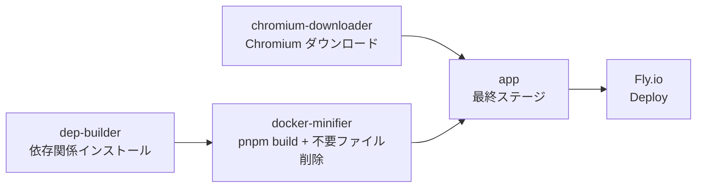

# RSSHub 仕様書

## 概要

このドキュメントでは、RSSHub のカスタムルートおよびデプロイ手順を記載します。

### プロジェクト情報

| 項目       | 内容                                                                  |
| ---------- | --------------------------------------------------------------------- |
| ベース     | [RSSHub](https://github.com/DIYgod/RSSHub)                            |
| デプロイ先 | Fly.io（アプリ名: `rsshub-khd00617`）                                 |
| 公開URL    | <https://rsshub-khd00617.fly.dev/>                                    |
| 主要ルート | `/youtube-official/channel/:id` — YouTube 最新動画 + OpenCode Go 要約 |

---

## プロジェクト構成

### 主要ファイル

| ファイル/ディレクトリ                | 説明                                                 |
| ------------------------------------ | ---------------------------------------------------- |
| `fly.toml`                           | Fly.io アプリ設定（ポート 1200、ヘルスチェックなど） |
| `Dockerfile`                         | マルチステージビルドの Dockerfile                    |
| `lib/config.ts`                      | 環境変数定義（`OPENCODE_API_KEY` を含む）            |
| `lib/middleware/cache.ts`            | 通常ルートと `/fulltext` のレスポンスキャッシュ      |
| `lib/utils/fulltext.ts`              | RSS記事の全文取得、文字コード復号、複数ページ結合    |
| `lib/utils/fulltext.test.ts`         | 全文取得と文字コード処理のテスト                     |
| `lib/routes/youtube-official/`       | YouTube 最新動画 + OpenCode Go 要約ルート            |
| `docs/youtube-latest-videos.md`      | 最新動画取得(公式 RSS / フォールバック)の知見        |
| `lib/routes/youtube/api/youtubei.ts` | YouTube 内部 API と検索による取得処理                |
| `lib/routes/cruise-mag/`             | クルーズマガジンニュースルート                       |
| `.dockerignore`                      | Docker ビルドコンテキストから不要ファイルを除外      |
| `package.json`                       | ビルドスクリプト、依存関係                           |
| `scripts/docker/`                    | Docker イメージ最適化スクリプト                      |

### カスタムルート一覧

| ルート                          | 説明                                              |
| ------------------------------- | ------------------------------------------------- |
| `/youtube-official/channel/:id` | YouTube チャンネルの最新5件を RSS + AI 要約で配信 |
| `/cruise-mag/news`              | クルーズマガジンのニュース一覧を RSS 配信         |

---

## ルート仕様: youtube-official

### ファイル構成

```text
lib/routes/youtube-official/
├── channel.ts          # メインルート: チャンネル ID / ハンドル → 最新動画 + 要約
├── namespace.ts        # 名前空間定義

lib/routes/youtube/api/
├── subtitles.ts        # YouTube 字幕取得
└── youtubei.ts         # YouTube 内部 API と検索結果の取得
```

### エンドポイント

`/youtube-official/channel/:id`

| パラメーター | 型       | 説明                                                    |
| ------------ | -------- | ------------------------------------------------------- |
| `id`         | `string` | YouTube チャンネル ID (`UC...`) またはハンドル (`@...`) |

#### 機能フラグ

| フラグ                                           | 値      | 説明                     |
| ------------------------------------------------ | ------- | ------------------------ |
| `requirePuppeteer`                               | `false` | Puppeteer 未使用         |
| `antiCrawler`                                    | `false` | アンチクローラー対策不要 |
| `supportBT` / `supportPodcast` / `supportScihub` | `false` | 非対応                   |

### データフロー

```mermaid
flowchart LR
    A[リクエスト<br/>/channel/:id] --> B{id の形式}
    B -->|UC...| C[チャンネル ID として使用]
    B -->|@...| D[YouTube ページから<br/>チャンネル ID を解決]
    C --> E[YouTube 公式 RSS<br/>から動画を取得]
    D --> E
    E -->|成功| H[RSS アイテムを使用]
    E -->|404 / 5xx| F[youtubei.js と<br/>チャンネルページを取得]
    F --> G[YouTube 検索結果も<br/>チャンネル ID で絞り込み]
    G --> I[重複除去・公開日時順に<br/>並べ替え・最新5件を選択]
    H --> J[各動画の字幕を取得]
    I --> J
    J --> K{字幕あり?}
    K -->|Yes| L[OpenCode Go API<br/>で日本語要約]
    K -->|No| M[動画説明文を<br/>そのまま使用]
    L --> N[Redis にキャッシュ]
    M --> N
    N --> O[RSS 出力]
```

### 主な機能

- **チャンネル ID 解決**: ハンドル形式 (`@...`) の場合、YouTube ページから `UC...` 形式のチャンネル ID を抽出
- **公式 RSS の利用**: YouTube 公式 Atom RSS が正常に応答する場合は、そのアイテムを使用
- **複数フォールバック**: 公式 RSS が `404` または `5xx` の場合(3 回リトライ後)は、`youtubei.js`(動画タブ + ライブ配信タブ)、チャンネルホーム、`/videos` ページ、直近1か月を対象にした YouTube 検索から取得
- **最新動画の選択**: 各取得元の動画をチャンネル ID で確認し、動画 ID で重複除去した後、公開日時の新しい順に並べて最大5件を出力
- **字幕取得**: `getSubtitlesByVideoId()` で字幕を取得し、タイムスタンプ行を除去
- **AI 要約**: 字幕を OpenCode Go API (`deepseek-v4-flash`) に送信し、日本語要約を生成
- **キャッシュ**: ルートレスポンスは `youtube-official-v3` 世代、要約結果は `youtube-opencode-summary:v5:{videoId}` としてキャッシュ（要約の有効期限は30日）。要約生成に失敗した場合はキャッシュせずフォールバックを使用
- **埋め込みプレイヤー**: RSS の `description` 先頭に YouTube 埋め込みプレイヤー (`<iframe>`) を挿入
- **エラーハンドリング**: 字幕取得失敗時は動画説明文をフォールバックとして使用

### 依存環境変数

| 変数名             | 必須 | 説明                 |
| ------------------ | ---- | -------------------- |
| `OPENCODE_API_KEY` | ✅   | OpenCode Go API キー |

ローカルではプロジェクト直下の `.env` に設定します。Fly.io では `.env` をデプロイせず、Secret として設定します。

---

## ルート仕様: cruise-mag

### ファイル構成

```text
lib/routes/cruise-mag/
├── index.ts           # /cruise-mag/news — ニュース一覧を RSS 配信
└── namespace.ts       # 名前空間定義
```

### エンドポイント

`/cruise-mag/news` — クルーズマガジンのニュース記事を RSS 配信

---

## ルート仕様: fulltext

### エンドポイント

`/fulltext/{feedPath}` は、公開RSSフィードを取得し、各アイテムの概要を元記事の全文へ置き換えます。

例:

```text
/fulltext/rss.itmedia.co.jp/rss/2.0/itmedia_all.xml
```

### データフロー

1. `feedPath` を `https://` のURLとして解決し、RSSを解析する
2. RSSアイテムごとに記事ページをバイナリで取得する
3. HTTP `Content-Type` の `charset` を優先し、存在しない場合はHTML内の `meta` 宣言を検査する
4. UTF-8以外の本文を `iconv-lite` で復号してから Mercury Parser に渡す
5. 同一オリジンの次ページリンクがある場合は最大20ページまで結合する
6. 生成したRSSレスポンスをキャッシュする

### 文字コードに関する知見

RSSフィード自体がUTF-8でも、リンク先の記事ページは記事カテゴリや旧テンプレートごとに文字コードが異なる場合があります。ITmediaでは、総合RSSはUTF-8ですが、`Content-Type` に `charset` がない `text/html` ページの中に `meta charset=shift_jis` を持つ記事が混在します。

そのため、記事HTMLを文字列として直接取得してから判定してはいけません。取得時点でUTF-8に変換されると、Shift_JISのバイト列が `�` に置換されて復元できなくなります。`ofetch.raw()` に `responseType: 'arrayBuffer'` を指定して元のバイト列を保持し、charset判定後に復号します。宣言がない場合の既定値はUTF-8です。

### キャッシュ世代

レスポンスや解析方法を変更した場合は、古い結果を返さないようキャッシュキーの世代を更新します。現在の世代は次のとおりです。

| 対象                                   | キーの世代                    | 定義場所                                 |
| -------------------------------------- | ----------------------------- | ---------------------------------------- |
| `/fulltext` のルートレスポンス         | `fulltext-v4`                 | `lib/middleware/cache.ts`                |
| `/youtube-official` のルートレスポンス | `youtube-official-v3`         | `lib/middleware/cache.ts`                |
| 記事ページの解析結果                   | `mercury-cache-page-v4`       | `lib/utils/fulltext.ts`                  |
| 記事ごとの全文結果                     | `mercury-cache-fulltext-v4`   | `lib/utils/fulltext.ts`                  |
| YouTube 要約結果                       | `youtube-opencode-summary:v5` | `lib/routes/youtube-official/channel.ts` |

キャッシュを更新せずにデプロイすると、修正済みコードでも過去の文字化け結果が返ることがあります。全文取得の解析方法を変更した場合は、外側のルートキャッシュと内側の全文キャッシュを同時に更新してください。
YouTube の取得元や最新動画の選定方法を変更した場合も、`youtube-official` のキャッシュ世代を更新してください。

---

## 環境変数

| 変数名             | 必須 | デフォルト | 説明                                              |
| ------------------ | ---- | ---------- | ------------------------------------------------- |
| `OPENCODE_API_KEY` | ✅   | —          | OpenCode Go API キー                              |
| `CACHE_TYPE`       |      | `memory`   | キャッシュ方式。本番では `redis` 推奨             |
| `REDIS_URL`        |      | —          | Redis 接続文字列（`CACHE_TYPE=redis` の場合必須） |
| `PORT`             |      | `1200`     | 内部ポート                                        |

ローカル開発では、プロジェクト直下の `.env` に秘密値を設定します。`.env` は Git にコミットしません。

```env
OPENCODE_API_KEY=<OpenCode Go API key>
```

---

## ビルドパイプライン

### Docker マルチステージビルド



| ステージ              | ベースイメージ        | 役割                                     |
| --------------------- | --------------------- | ---------------------------------------- |
| `dep-builder`         | `node:24-trixie`      | pnpm install、依存関係解決               |
| `dep-version-parser`  | `debian:trixie-slim`  | バージョン情報抽出（キャッシュ最適化用） |
| `docker-minifier`     | `node:24-trixie-slim` | `pnpm build`、不要ファイル削除           |
| `chromium-downloader` | `node:24-trixie-slim` | Chromium ダウンロード（任意）            |
| `app`                 | `node:24-trixie-slim` | 最小実行イメージ                         |

`.dockerignore` で `.git/objects`、`dist`、開発用設定、テスト用ディレクトリなどをビルドコンテキストから除外します。`docker-minifier` はビルド後に `lib`、`scripts`、開発依存関係を最終イメージから除去します。

### ローカルビルド・チェック

```powershell
# lint & フォーマット
corepack pnpm exec oxfmt lib/routes/youtube-official/channel.ts
corepack pnpm exec oxlint lib/routes/youtube-official/channel.ts

# 本番ビルド
corepack pnpm run build

# 開発サーバー
corepack pnpm dev
```

成功すると `dist/` 以下にルートごとの `.mjs` が生成されます。

### 全文取得のローカル検証

```powershell
# 依存関係を復元（初回または node_modules がない場合）
pnpm install --frozen-lockfile

# 文字コード処理を含む対象テスト
pnpm exec vitest run lib/utils/fulltext.test.ts

# 変更ファイルの静的検査
pnpm exec eslint lib/middleware/cache.ts lib/utils/fulltext.ts lib/utils/fulltext.test.ts
pnpm exec oxlint --type-aware lib/middleware/cache.ts lib/utils/fulltext.ts lib/utils/fulltext.test.ts
```

開発サーバーで実際のレスポンスを確認する場合:

```powershell
pnpm dev
Invoke-WebRequest -Uri 'http://localhost:1200/fulltext/rss.itmedia.co.jp/rss/2.0/itmedia_all.xml' -UseBasicParsing
```

レスポンス本文に `�` が含まれていないことを確認します。メモリキャッシュが残っている場合は開発サーバーを再起動してください。

YouTube 公式ルートを確認する場合:

```powershell
Invoke-WebRequest -Uri 'http://localhost:1200/youtube-official/channel/@3.0' -UseBasicParsing
```

公式 RSS が `404` を返すチャンネルでも、チャンネルページ・`youtubei.js`・YouTube 検索から動画を取得し、最新5件の `<item>` が返ることを確認します。

---

## デプロイ手順

### 0. GitHub 認証（プッシュが必要な場合）

`khd00617` アカウントがGitHub CLIに登録済みの場合:

```powershell
gh auth switch --user khd00617
gh auth setup-git
gh auth status
```

`gh auth status` で `khd00617` がアクティブになっていることを確認してから、次を実行します。

```powershell
git push origin master
```

### 1. シークレットの設定（初回のみ）

```powershell
# OpenCode API キー
flyctl secrets set OPENCODE_API_KEY="<API_KEY>" --app rsshub-khd00617

# Redis を使用する場合（任意）
flyctl secrets set REDIS_URL="redis://..." --app rsshub-khd00617
```

### 2. Fly.io へデプロイ

```powershell
flyctl deploy --config fly.toml --remote-only
```

ビルド・イメージ作成・ロールアウトが自動で行われます。
正常に完了すると以下のような出力が得られます。

```
image: registry.fly.io/rsshub-khd00617:deployment-01KY97BJ0FHPE603VBNBGHZ8W8
Updating existing machines in 'rsshub-khd00617' with rolling strategy
✔ Cleared lease for 78451d2a1e4138
```

### 3. デプロイ状態の確認

```powershell
# アプリ状態と Machine 一覧
flyctl status --app rsshub-khd00617

# 最新ログ
flyctl logs --app rsshub-khd00617 --no-tail | Select-Object -Last 20
```

期待する状態:

- `STATE` が `started`
- `CHECKS` が `1 total, 1 passing`
- イメージが最新のデプロイ ID であること

### 4. 動作確認

```powershell
# ヘルスチェック
Invoke-WebRequest -Uri 'https://rsshub-khd00617.fly.dev/healthz' -UseBasicParsing

# 全文RSS。limit=20 は同じフィードを取得しつつ、確認時に別のルートキャッシュキーを使う
Invoke-WebRequest -Uri 'https://rsshub-khd00617.fly.dev/fulltext/rss.itmedia.co.jp/rss/2.0/itmedia_all.xml?limit=20' -UseBasicParsing

# チャンネル ID 指定 (UC...)
Invoke-WebRequest -Uri 'https://rsshub-khd00617.fly.dev/youtube-official/channel/UCJHLwoEJ55msgoxeiqJjOvA' -UseBasicParsing

# ハンドル指定 (@...)
Invoke-WebRequest -Uri 'https://rsshub-khd00617.fly.dev/youtube-official/channel/@3.0' -UseBasicParsing
```

期待するレスポンス:

- `Status: 200`
- `Content-Type: application/xml; charset=utf-8`
- 5 件の `<item>` を含む
- 各 `<item><link>` が `https://www.youtube.com/watch?v=...` または `https://www.youtube.com/shorts/...` の元動画URLを保持する

---

## ヘルスチェック

`fly.toml` の設定:

```toml
[[http_service.checks]]
grace_period = "10s"
interval = "30s"
method = "GET"
timeout = "5s"
path = "/healthz"
```

RSSHub は `/healthz` に対して `200` を返します。
起動直後は約 10 秒でヘルスチェックが通過します。

---

## トラブルシューティング

### `/fulltext` の記事だけ文字化けする

まず元RSSと `/fulltext` のレスポンスを比較します。元RSSが正常で全文RSSに `�` が含まれる場合、RSSの文字コードではなく記事ページの取得またはキャッシュを確認します。

```powershell
$response = Invoke-WebRequest -Uri 'https://rsshub-khd00617.fly.dev/fulltext/rss.itmedia.co.jp/rss/2.0/itmedia_all.xml?limit=20' -UseBasicParsing
($response.Content.ToCharArray() | Where-Object { [int]$_ -eq 0xFFFD }).Count
```

結果が `0` なら、少なくともレスポンス本文にUnicodeの置換文字はありません。古い結果が残る場合は、次を確認します。

- 外側の `/fulltext` キャッシュ世代が更新されているか
- `mercury-cache-page` と `mercury-cache-fulltext` の世代も更新されているか
- `Cache-Control: max-age=300` によるエッジキャッシュの有効期限が残っていないか
- Fly.io の Machine が最新イメージで `started`、ヘルスチェックが `passing` になっているか

### GitHub の push が 403 になる

Gitの認証ユーザーがリポジトリの所有者または書き込み権限を持つアカウントか確認します。複数アカウントを登録している場合は、`gh auth switch --user khd00617` と `gh auth setup-git` を実行してから再試行します。

### デプロイ後も古いログが表示される

Fly.io では過去の Machine バージョンのログも表示されます。
現在のイメージとログのタイムスタンプを確認して、正しいバージョンのログを参照してください。

### YouTube 公式ルートが 503 + Status code 404 になる

YouTube のチャンネルページが正常でも、公式 Atom RSS (`/feeds/videos.xml`) が `404` を返す場合があります。この場合は API キーやチャンネルハンドルの誤りとは限りません。

- Fly のログに `YouTube RSS unavailable` が出ていることを確認する
- `youtubei.js`、チャンネルホーム、`/videos` ページ、YouTube 検索の取得結果が統合されることを確認する
- 動画 ID が対象チャンネルのものだけか、公開日時順に並んでいるかを確認する
- 古い動画が残る場合は `youtube-official-v3` キャッシュ世代が反映された最新イメージか確認する

公開 RSS が正常に返る場合は公式 RSS のアイテムをそのまま使用します。初回取得は字幕取得と OpenCode Go 要約のため時間がかかる場合がありますが、要約キャッシュ後は短縮されます。

### OpenCode Go API が 400 Bad Request (MissingSessionID) になる

OpenCode Go は `x-opencode-session` ヘッダー（会話ごとに安定したセッション ID）と独自の `User-Agent` を要求します。ヘッダーがないリクエストは `400 MissingSessionID` で拒否されます。

- `lib/routes/youtube-official/channel.ts` の `summarizeVideo()` で両ヘッダーを送信しているか確認する
- エラーメッセージ例: `Request is missing x-opencode-session and cannot be routed efficiently`
- 詳細は <https://opencode.ai/docs/go/#where-can-i-use-it> を参照

### YouTube 公式ルートが 503 + Status code 500 になる

YouTube 側または取得元の応答エラーです。チャンネルページ取得に `User-Agent` と `Accept-Language` が設定されているか、Fly の最新ログに外部 API のエラーがないか確認してください。

### 503 + Health check failing

アプリの起動が完了するまでに時間がかかっています。
`grace_period` と `interval` を調整するか、アプリの起動時間を短縮してください。

### ビルドが depot builder で長時間待機する

Depot ビルダーのリソース確保待ちです。数分経っても進まない場合は `Ctrl+C` でキャンセルし、再度デプロイしてください。

---

## シークレットローテーション

API キーが露出した場合:

```powershell
# 1. OpenCode 管理画面で古いキーを失効
# 2. 新しいキーを Fly.io に設定
flyctl secrets set OPENCODE_API_KEY="<新しいキー>" --app rsshub-khd00617

# 3. 再デプロイ
flyctl deploy --config fly.toml --remote-only
```

---

## 変更履歴

### 2026-09-09: フォールバック経路の安定化(最新動画の取得確率向上)

**対象**: `lib/routes/youtube-official/channel.ts`、`lib/routes/youtube/api/youtubei.ts`

**変更内容**:

- YouTube 公式 RSS 取得に 3 回・1.5 秒間隔のリトライを追加(`parser.parseURL` から got + `parseString` に変更し UA / Accept-Language も制御)
- youtubei.js の `getLiveStreams()`(ライブ配信タブ)を `getDataByChannelId` の `includeLive` オプションでマージ。ライブ配信・プレミア公開の取りこぼしを防止(標準ルートはデフォルト false で影響なし)
- チャンネルページ解析(`ytInitialData`)が 0 件のとき 1 回再取得
- YouTube の InnerTube 応答が新形式 `LockupView` に移行したため、動画タブ・ライブタブのアイテムを新形式で解析(`content_id` / `metadata.title` / `metadata_rows` から日時抽出)。旧形式も引き続きサポート
- 日本語ロケール(`lang: 'ja'`, `location: 'JP'`)で youtubei.js を実行し、タイトルを日本語化
- 日本語相対日時の正規化を強化: 「1 か月前」「1 ヶ月前」→「1 月前」、ライブ配信の「7 時間前 に配信済み」(スペース含む)→「7 時間前」。パース不能な場合は Invalid Date ではなく undefined を返す
- マージキーを動画 ID に正規化(RSS guid `yt:video:ID` / ページ guid `ID` / youtubei の link の混在で重複が残る問題を修正)。先頭ソースのフィールドを優先し、欠けているフィールドのみ後続ソースで補完
- ページ解析アイテムの pubDate 欠落時、新着順リスティングの隣接アイテムから日時を補間
- 出力の pubDate に Invalid Date が混入しないようガードを追加

### 2026-09-09: OpenCode Go セッションヘッダー要件への対応

**対象**: `lib/routes/youtube-official/channel.ts`、`lib/middleware/cache.ts`

**変更内容**:

- OpenCode Go API リクエストに `x-opencode-session`（動画ごとに安定したセッション ID）と独自 `User-Agent` を追加。ヘッダー欠落時は API が `400 MissingSessionID` で拒否するため
- 要約生成に失敗した場合に失敗結果（エラーメッセージや AI の「文字起こしなし」応答）が30日間キャッシュされる問題を修正。失敗時は例外を投げてキャッシュしない
- 「要約を取得できませんでした」のプレースホルダーを AI への入力に使わないよう分離
- 要約キャッシュキーを `v4` → `v5` に、ルートレスポンスキャッシュを `youtube-official-v2` → `v3` に更新し、汚染済みキャッシュを無効化

### 2026-08-19: YouTube 最新動画の取得経路を拡張

**対象**: `lib/routes/youtube-official/channel.ts`、`lib/routes/youtube/api/youtubei.ts`、`lib/middleware/cache.ts`

**変更内容**:

- YouTube 公式 Atom RSS が `404` / `5xx` の場合に処理を継続するフォールバックを追加
- YouTube チャンネルホームと `/videos` ページの `ytInitialData` を解析
- `youtubei.js` のチャンネル取得結果と、対象チャンネル ID で絞った YouTube 検索結果を統合
- 動画 ID の重複を除去し、公開日時の新しい順に並べて最新5件を出力
- 日本語の相対日時（`か月前`、`ヶ月前` など）を正規化して比較
- `/youtube-official` のレスポンスキャッシュを `youtube-official-v2` 世代へ更新
- RSS アイテムのリンクは各動画の元 URL（`watch?v=...` または `shorts/...`）を保持

### 新規ルート作成

#### youtube-official

`lib/routes/youtube-official/` に YouTube 最新動画 + OpenCode Go 要約ルートを新規作成。

| ファイル       | 説明                                                     |
| -------------- | -------------------------------------------------------- |
| `channel.ts`   | メインルート: チャンネル ID / ハンドル → 最新動画 + 要約 |
| `namespace.ts` | 名前空間定義 (`YouTube Official RSS`)                    |

開発の経緯:

1. OpenCode のエンドポイントを Zen 汎用から Go 専用 (`/zen/go/v1/chat/completions`) に変更
2. 字幕要約 API のキャッシュキーを `v3` → `v4` に更新
3. ハンドル形式 (`@...`) のサポートを追加
4. 日本語ハンドルの URL エンコード問題を修正（`decodeURIComponent()` + `new URL()`）
5. YouTube からの 500 エラー対策として `User-Agent` と `Accept-Language` ヘッダーを追加

#### cruise-mag

`lib/routes/cruise-mag/` にクルーズマガジンのニュース配信ルートを新規作成。

| ファイル       | 説明                                         |
| -------------- | -------------------------------------------- |
| `index.ts`     | `/cruise-mag/news` — ニュース一覧を RSS 配信 |
| `namespace.ts` | 名前空間定義                                 |

### 既存ファイルの修正

| ファイル        | 変更内容                                                                                                                                                                |
| --------------- | ----------------------------------------------------------------------------------------------------------------------------------------------------------------------- |
| `fly.toml`      | アプリ名を `rsshub` → `rsshub-khd00617` に変更、`primary_region = "nrt"` 追加、ビルド設定追加、`[vm] memory = "512mb"` 追加、`min_machines_running` を `1` → `0` に変更 |
| `lib/config.ts` | `OPENCODE_API_KEY` 環境変数を型定義に追加                                                                                                                               |
| `.dockerignore` | `.git/objects` と `dist` などを除外し、Docker ビルドコンテキストを削減                                                                                                  |

### 2026-08-18: fulltext の日本語文字化け修正

#### 1. 記事ページの文字コードを宣言に従って復号

**対象**: [`lib/utils/fulltext.ts`](lib/utils/fulltext.ts)

**変更内容**:

- `ofetch.raw()` と `arrayBuffer` で記事HTMLの元バイト列を取得
- HTTPヘッダーの `charset` を優先し、なければHTMLの `meta charset` を使用
- `iconv-lite` でShift_JISなどを復号してからMercury Parserへ渡す
- Shift_JISの日本語HTMLを再現する単体テストを追加

#### 2. 既存の文字化けキャッシュを無効化

**対象**: [`lib/middleware/cache.ts`](lib/middleware/cache.ts)、[`lib/utils/fulltext.ts`](lib/utils/fulltext.ts)

**変更内容**:

- `/fulltext` のルートキャッシュを `fulltext-v3` から `fulltext-v4` へ更新
- 記事ページ・全文結果のキャッシュを `v3` から `v4` へ更新

文字コード処理だけを修正しても、永続キャッシュが旧結果を返す場合があります。解析ロジックを変更するデプロイでは、関連するキャッシュキーの世代更新を同じ変更に含めます。

### 2026-07-25: 埋め込みプレイヤー追加 & Lint 修正

#### 1. RSS description に YouTube 埋め込みプレイヤーを追加

**対象**: `lib/routes/youtube-official/channel.ts` — `createItem` 関数

**変更内容**:

- `videoId` が取得できた場合、RSS の `description` フィールド先頭に `<iframe>` による YouTube 埋め込みプレイヤーを挿入
- 埋め込みプレイヤーは `https://www.youtube.com/embed/${videoId}` を `src` とし、`allowfullscreen` 対応
- プレイヤー後には `<br><br>` で区切り、その後に要約（summary）が続く
- `videoId` がない場合は従来通り summary のみを description に設定

```typescript
const embedHtml = videoId
    ? `<iframe width="560" height="315" src="https://www.youtube.com/embed/${videoId}" frameborder="0" allow="accelerometer; autoplay; clipboard-write; encrypted-media; gyroscope; picture-in-picture" allowfullscreen></iframe><br><br>`
    : '';

return {
    // ...existing fields...
    description: `${embedHtml}${summary || description}`,
};
```

#### 2. 複数行文字列リテラルの Lint エラー修正

**対象**: `lib/routes/youtube-official/channel.ts` — `summarizeVideo` 関数内の `system` メッセージ `content`

**変更内容**:

- シングルクォート `'...'` で記述されていた複数行の `content` 文字列をテンプレートリテラル（バッククォート `` `...` ``）に変更
- これにより `未終了の文字列リテラルです` エラーを解消

### 2026-07-25: description の改行・Markdown 強調対応

#### 1. 改行 (`\n`) を `<br>` に変換

**対象**: `lib/routes/youtube-official/channel.ts` — `createItem` 関数

**変更内容**:

- AI 要約テキスト内の改行文字 `\n` を HTML の `<br>` タグに変換
- RSS リーダー上で適切に段落分けされて表示されるようになる

#### 2. Markdown 強調 (`**text**`) を HTML 強調 (`<strong>text</strong>`) に変換

**対象**: `lib/routes/youtube-official/channel.ts` — `createItem` 関数

**変更内容**:

- OpenCode API の応答に含まれる `**～**` 形式の Markdown 強調記法を `<strong>～</strong>` に変換
- これにより RSS リーダー上で強調文字が正しく太字表示される

```typescript
const formattedSummary = (summary || description).replace(/\*\*(.+?)\*\*/g, '<strong>$1</strong>').replace(/\n/g, '<br>');
```

---

## 参考リンク

- [RSSHub 公式ドキュメント](https://docs.rsshub.app/)
- [Fly.io ドキュメント](https://fly.io/docs/)
- [OpenCode Go API](https://opencode.ai/zen/go/v1/chat/completions)
