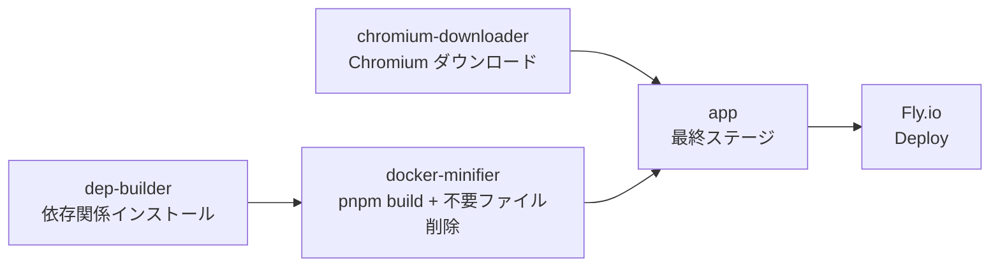

# RSSHub 仕様書

## 概要

このドキュメントでは、RSSHub のカスタムルートおよびデプロイ手順を記載します。

### プロジェクト情報

| 項目       | 内容                                                                  |
| ---------- | --------------------------------------------------------------------- |
| ベース     | [RSSHub](https://github.com/DIYgod/RSSHub)                            |
| デプロイ先 | Fly.io（アプリ名: `rsshub-khd00617`）                                 |
| 主要ルート | `/youtube-official/channel/:id` — YouTube 公式 RSS + OpenCode Go 要約 |

---

## プロジェクト構成

### 主要ファイル

| ファイル/ディレクトリ          | 説明                                                 |
| ------------------------------ | ---------------------------------------------------- |
| `fly.toml`                     | Fly.io アプリ設定（ポート 1200、ヘルスチェックなど） |
| `Dockerfile`                   | マルチステージビルドの Dockerfile                    |
| `lib/config.ts`                | 環境変数定義（`OPENCODE_API_KEY` を含む）            |
| `lib/middleware/cache.ts`      | 通常ルートと `/fulltext` のレスポンスキャッシュ      |
| `lib/utils/fulltext.ts`        | RSS記事の全文取得、文字コード復号、複数ページ結合    |
| `lib/utils/fulltext.test.ts`   | 全文取得と文字コード処理のテスト                     |
| `lib/routes/youtube-official/` | YouTube 公式 RSS + OpenCode Go 要約ルート            |
| `lib/routes/cruise-mag/`       | クルーズマガジンニュースルート                       |
| `package.json`                 | ビルドスクリプト、依存関係                           |
| `scripts/docker/`              | Docker イメージ最適化スクリプト                      |

### カスタムルート一覧

| ルート                          | 説明                                               |
| ------------------------------- | -------------------------------------------------- |
| `/youtube-official/channel/:id` | YouTube チャンネルの最新動画を RSS + AI 要約で配信 |
| `/cruise-mag/news`              | クルーズマガジンのニュース一覧を RSS 配信          |

---

## ルート仕様: youtube-official

### ファイル構成

```text
lib/routes/youtube-official/
├── channel.ts          # メインルート: チャンネル ID / ハンドル → RSS + 要約
├── namespace.ts        # 名前空間定義
└── api/
    └── subtitles.ts    # YouTube 字幕取得
```

### エンドポイント

`/youtube-official/channel/:id`

| パラメーター | 型       | 説明                                                    |
| ------------ | -------- | ------------------------------------------------------- |
| `id`         | `string` | YouTube チャンネル ID (`UC...`) またはハンドル (`@...`) |

#### 機能フラグ

| フラグ                                           | 値      | 説明                     |
| ------------------------------------------------ | ------- | ------------------------ |
| `requirePuppeteer`                               | `false` | Puppeteer 未使用         |
| `antiCrawler`                                    | `false` | アンチクローラー対策不要 |
| `supportBT` / `supportPodcast` / `supportScihub` | `false` | 非対応                   |

### データフロー

```mermaid
flowchart LR
    A[リクエスト<br/>/channel/:id] --> B{id の形式}
    B -->|UC...| C[チャンネル ID として使用]
    B -->|@...| D[YouTube ページから<br/>チャンネル ID を解決]
    C --> E[YouTube 公式 RSS<br/>から最新 5 件取得]
    D --> E
    E --> F[各動画の字幕を取得]
    F --> G{字幕あり?}
    G -->|Yes| H[OpenCode Go API<br/>で日本語要約]
    G -->|No| I[動画説明文を<br/>そのまま使用]
    H --> J[Redis にキャッシュ]
    J --> K[RSS 出力]
    I --> K
```

### 主な機能

- **チャンネル ID 解決**: ハンドル形式 (`@...`) の場合、YouTube ページから `UC...` 形式のチャンネル ID を抽出
- **字幕取得**: `getSubtitlesByVideoId()` で字幕を取得し、タイムスタンプ行を除去
- **AI 要約**: 字幕を OpenCode Go API (`deepseek-v4-flash`) に送信し、日本語要約を生成
- **キャッシュ**: 要約結果は Redis にキャッシュ（キー: `youtube-opencode-summary:v4:{videoId}`、有効期限 30 日）
- **埋め込みプレイヤー**: RSS の `description` 先頭に YouTube 埋め込みプレイヤー (`<iframe>`) を挿入
- **エラーハンドリング**: 字幕取得失敗時は動画説明文をフォールバックとして使用

### 依存環境変数

| 変数名             | 必須 | 説明                 |
| ------------------ | ---- | -------------------- |
| `OPENCODE_API_KEY` | ✅   | OpenCode Go API キー |

---

## ルート仕様: cruise-mag

### ファイル構成

```text
lib/routes/cruise-mag/
├── index.ts           # /cruise-mag/news — ニュース一覧を RSS 配信
└── namespace.ts       # 名前空間定義
```

### エンドポイント

`/cruise-mag/news` — クルーズマガジンのニュース記事を RSS 配信

---

## ルート仕様: fulltext

### エンドポイント

`/fulltext/{feedPath}` は、公開RSSフィードを取得し、各アイテムの概要を元記事の全文へ置き換えます。

例:

```text
/fulltext/rss.itmedia.co.jp/rss/2.0/itmedia_all.xml
```

### データフロー

1. `feedPath` を `https://` のURLとして解決し、RSSを解析する
2. RSSアイテムごとに記事ページをバイナリで取得する
3. HTTP `Content-Type` の `charset` を優先し、存在しない場合はHTML内の `meta` 宣言を検査する
4. UTF-8以外の本文を `iconv-lite` で復号してから Mercury Parser に渡す
5. 同一オリジンの次ページリンクがある場合は最大20ページまで結合する
6. 生成したRSSレスポンスをキャッシュする

### 文字コードに関する知見

RSSフィード自体がUTF-8でも、リンク先の記事ページは記事カテゴリや旧テンプレートごとに文字コードが異なる場合があります。ITmediaでは、総合RSSはUTF-8ですが、`Content-Type` に `charset` がない `text/html` ページの中に `meta charset=shift_jis` を持つ記事が混在します。

そのため、記事HTMLを文字列として直接取得してから判定してはいけません。取得時点でUTF-8に変換されると、Shift_JISのバイト列が `�` に置換されて復元できなくなります。`ofetch.raw()` に `responseType: 'arrayBuffer'` を指定して元のバイト列を保持し、charset判定後に復号します。宣言がない場合の既定値はUTF-8です。

### キャッシュ世代

全文取得のキャッシュキーは、レスポンス形式や文字コード処理を変更した際に世代を更新します。現在の世代は次のとおりです。

| 対象                           | キーの世代                  | 定義場所                  |
| ------------------------------ | --------------------------- | ------------------------- |
| `/fulltext` のルートレスポンス | `fulltext-v4`               | `lib/middleware/cache.ts` |
| 記事ページの解析結果           | `mercury-cache-page-v4`     | `lib/utils/fulltext.ts`   |
| 記事ごとの全文結果             | `mercury-cache-fulltext-v4` | `lib/utils/fulltext.ts`   |

キャッシュを更新せずにデプロイすると、修正済みコードでも過去の文字化け結果が返ることがあります。全文取得の解析方法を変更した場合は、外側のルートキャッシュと内側の全文キャッシュを同時に更新してください。

---

## 環境変数

| 変数名             | 必須 | デフォルト | 説明                                              |
| ------------------ | ---- | ---------- | ------------------------------------------------- |
| `OPENCODE_API_KEY` | ✅   | —          | OpenCode Go API キー                              |
| `CACHE_TYPE`       |      | `memory`   | キャッシュ方式。本番では `redis` 推奨             |
| `REDIS_URL`        |      | —          | Redis 接続文字列（`CACHE_TYPE=redis` の場合必須） |
| `PORT`             |      | `1200`     | 内部ポート                                        |

---

## ビルドパイプライン

### Docker マルチステージビルド



| ステージ              | ベースイメージ        | 役割                                     |
| --------------------- | --------------------- | ---------------------------------------- |
| `dep-builder`         | `node:24-trixie`      | pnpm install、依存関係解決               |
| `dep-version-parser`  | `debian:trixie-slim`  | バージョン情報抽出（キャッシュ最適化用） |
| `docker-minifier`     | `node:24-trixie-slim` | `pnpm build`、不要ファイル削除           |
| `chromium-downloader` | `node:24-trixie-slim` | Chromium ダウンロード（任意）            |
| `app`                 | `node:24-trixie-slim` | 最小実行イメージ                         |

### ローカルビルド・チェック

```powershell
# lint & フォーマット
corepack pnpm exec oxfmt lib/routes/youtube-official/channel.ts
corepack pnpm exec oxlint lib/routes/youtube-official/channel.ts

# 本番ビルド
corepack pnpm run build
```

成功すると `dist/` 以下にルートごとの `.mjs` が生成されます。

### 全文取得のローカル検証

```powershell
# 依存関係を復元（初回または node_modules がない場合）
pnpm install --frozen-lockfile

# 文字コード処理を含む対象テスト
pnpm exec vitest run lib/utils/fulltext.test.ts

# 変更ファイルの静的検査
pnpm exec eslint lib/middleware/cache.ts lib/utils/fulltext.ts lib/utils/fulltext.test.ts
pnpm exec oxlint --type-aware lib/middleware/cache.ts lib/utils/fulltext.ts lib/utils/fulltext.test.ts
```

開発サーバーで実際のレスポンスを確認する場合:

```powershell
pnpm dev
Invoke-WebRequest -Uri 'http://localhost:1200/fulltext/rss.itmedia.co.jp/rss/2.0/itmedia_all.xml' -UseBasicParsing
```

レスポンス本文に `�` が含まれていないことを確認します。メモリキャッシュが残っている場合は開発サーバーを再起動してください。

---

## デプロイ手順

### 0. GitHub 認証（プッシュが必要な場合）

`khd00617` アカウントがGitHub CLIに登録済みの場合:

```powershell
gh auth switch --user khd00617
gh auth setup-git
gh auth status
```

`gh auth status` で `khd00617` がアクティブになっていることを確認してから、次を実行します。

```powershell
git push origin master
```

### 1. シークレットの設定（初回のみ）

```powershell
# OpenCode API キー
flyctl secrets set OPENCODE_API_KEY="<API_KEY>" --app rsshub-khd00617

# Redis を使用する場合（任意）
flyctl secrets set REDIS_URL="redis://..." --app rsshub-khd00617
```

### 2. Fly.io へデプロイ

```powershell
flyctl deploy --app rsshub-khd00617 --remote-only --yes
```

ビルド・イメージ作成・ロールアウトが自動で行われます。
正常に完了すると以下のような出力が得られます。

```
image: registry.fly.io/rsshub-khd00617:deployment-01KY97BJ0FHPE603VBNBGHZ8W8
Updating existing machines in 'rsshub-khd00617' with rolling strategy
✔ Cleared lease for 78451d2a1e4138
```

### 3. デプロイ状態の確認

```powershell
# アプリ状態と Machine 一覧
flyctl status --app rsshub-khd00617

# 最新ログ
flyctl logs --app rsshub-khd00617 --no-tail | Select-Object -Last 20
```

期待する状態:

- `STATE` が `started`
- `CHECKS` が `1 total, 1 passing`
- イメージが最新のデプロイ ID であること

### 4. 動作確認

```powershell
# ヘルスチェック
Invoke-WebRequest -Uri 'https://rsshub-khd00617.fly.dev/healthz' -UseBasicParsing

# 全文RSS。limit=20 は同じフィードを取得しつつ、確認時に別のルートキャッシュキーを使う
Invoke-WebRequest -Uri 'https://rsshub-khd00617.fly.dev/fulltext/rss.itmedia.co.jp/rss/2.0/itmedia_all.xml?limit=20' -UseBasicParsing

# チャンネル ID 指定 (UC...)
Invoke-WebRequest -Uri 'https://rsshub-khd00617.fly.dev/youtube-official/channel/UCJHLwoEJ55msgoxeiqJjOvA' -UseBasicParsing

# ハンドル指定 (@...)
Invoke-WebRequest -Uri 'https://rsshub-khd00617.fly.dev/youtube-official/channel/%40%E3%82%A2%E3%82%B4%E3%83%A9%E3%83%81%E3%83%A3%E3%83%B3%E3%83%8D%E3%83%AB' -UseBasicParsing
```

期待するレスポンス:

- `Status: 200`
- `Content-Type: application/xml; charset=utf-8`
- 5 件の `<item>` を含む
- エラーメッセージ（`Could not resolve` / `要約を取得できませんでした`）が含まれない

---

## ヘルスチェック

`fly.toml` の設定:

```toml
[[http_service.checks]]
grace_period = "10s"
interval = "30s"
method = "GET"
timeout = "5s"
path = "/healthz"
```

RSSHub は `/healthz` に対して `200` を返します。
起動直後は約 10 秒でヘルスチェックが通過します。

---

## トラブルシューティング

### `/fulltext` の記事だけ文字化けする

まず元RSSと `/fulltext` のレスポンスを比較します。元RSSが正常で全文RSSに `�` が含まれる場合、RSSの文字コードではなく記事ページの取得またはキャッシュを確認します。

```powershell
$response = Invoke-WebRequest -Uri 'https://rsshub-khd00617.fly.dev/fulltext/rss.itmedia.co.jp/rss/2.0/itmedia_all.xml?limit=20' -UseBasicParsing
($response.Content.ToCharArray() | Where-Object { [int]$_ -eq 0xFFFD }).Count
```

結果が `0` なら、少なくともレスポンス本文にUnicodeの置換文字はありません。古い結果が残る場合は、次を確認します。

- 外側の `/fulltext` キャッシュ世代が更新されているか
- `mercury-cache-page` と `mercury-cache-fulltext` の世代も更新されているか
- `Cache-Control: max-age=300` によるエッジキャッシュの有効期限が残っていないか
- Fly.io の Machine が最新イメージで `started`、ヘルスチェックが `passing` になっているか

### GitHub の push が 403 になる

Gitの認証ユーザーがリポジトリの所有者または書き込み権限を持つアカウントか確認します。複数アカウントを登録している場合は、`gh auth switch --user khd00617` と `gh auth setup-git` を実行してから再試行します。

### デプロイ後も古いログが表示される

Fly.io では過去の Machine バージョンのログも表示されます。
現在のイメージとログのタイムスタンプを確認して、正しいバージョンのログを参照してください。

### 503 + Status code 404 / 500

- **404**: ルートパラメーターの URL デコードが正しく行われていない可能性があります。`decodeURIComponent()` が適用されているか確認してください。
- **500**: YouTube サーバーからの応答エラー。`User-Agent` と `Accept-Language` ヘッダーを適切に設定してください。

### 503 + Health check failing

アプリの起動が完了するまでに時間がかかっています。
`grace_period` と `interval` を調整するか、アプリの起動時間を短縮してください。

### ビルドが depot builder で長時間待機する

Depot ビルダーのリソース確保待ちです。数分経っても進まない場合は `Ctrl+C` でキャンセルし、再度デプロイしてください。

---

## シークレットローテーション

API キーが露出した場合:

```powershell
# 1. OpenCode 管理画面で古いキーを失効
# 2. 新しいキーを Fly.io に設定
flyctl secrets set OPENCODE_API_KEY="<新しいキー>" --app rsshub-khd00617

# 3. 再デプロイ
flyctl deploy --app rsshub-khd00617
```

---

## 変更履歴

### 新規ルート作成

#### youtube-official

`lib/routes/youtube-official/` に YouTube 公式 RSS + OpenCode Go 要約ルートを新規作成。

| ファイル       | 説明                                                |
| -------------- | --------------------------------------------------- |
| `channel.ts`   | メインルート: チャンネル ID / ハンドル → RSS + 要約 |
| `namespace.ts` | 名前空間定義 (`YouTube Official RSS`)               |

開発の経緯:

1. OpenCode のエンドポイントを Zen 汎用から Go 専用 (`/zen/go/v1/chat/completions`) に変更
2. 字幕要約 API のキャッシュキーを `v3` → `v4` に更新
3. ハンドル形式 (`@...`) のサポートを追加
4. 日本語ハンドルの URL エンコード問題を修正（`decodeURIComponent()` + `new URL()`）
5. YouTube からの 500 エラー対策として `User-Agent` と `Accept-Language` ヘッダーを追加

#### cruise-mag

`lib/routes/cruise-mag/` にクルーズマガジンのニュース配信ルートを新規作成。

| ファイル       | 説明                                         |
| -------------- | -------------------------------------------- |
| `index.ts`     | `/cruise-mag/news` — ニュース一覧を RSS 配信 |
| `namespace.ts` | 名前空間定義                                 |

### 既存ファイルの修正

| ファイル        | 変更内容                                                                                                                                                                |
| --------------- | ----------------------------------------------------------------------------------------------------------------------------------------------------------------------- |
| `fly.toml`      | アプリ名を `rsshub` → `rsshub-khd00617` に変更、`primary_region = "nrt"` 追加、ビルド設定追加、`[vm] memory = "512mb"` 追加、`min_machines_running` を `1` → `0` に変更 |
| `lib/config.ts` | `OPENCODE_API_KEY` 環境変数を型定義に追加                                                                                                                               |

### 2026-08-18: fulltext の日本語文字化け修正

#### 1. 記事ページの文字コードを宣言に従って復号

**対象**: [`lib/utils/fulltext.ts`](lib/utils/fulltext.ts)

**変更内容**:

- `ofetch.raw()` と `arrayBuffer` で記事HTMLの元バイト列を取得
- HTTPヘッダーの `charset` を優先し、なければHTMLの `meta charset` を使用
- `iconv-lite` でShift_JISなどを復号してからMercury Parserへ渡す
- Shift_JISの日本語HTMLを再現する単体テストを追加

#### 2. 既存の文字化けキャッシュを無効化

**対象**: [`lib/middleware/cache.ts`](lib/middleware/cache.ts)、[`lib/utils/fulltext.ts`](lib/utils/fulltext.ts)

**変更内容**:

- `/fulltext` のルートキャッシュを `fulltext-v3` から `fulltext-v4` へ更新
- 記事ページ・全文結果のキャッシュを `v3` から `v4` へ更新

文字コード処理だけを修正しても、永続キャッシュが旧結果を返す場合があります。解析ロジックを変更するデプロイでは、関連するキャッシュキーの世代更新を同じ変更に含めます。

### 2026-07-25: 埋め込みプレイヤー追加 & Lint 修正

#### 1. RSS description に YouTube 埋め込みプレイヤーを追加

**対象**: `lib/routes/youtube-official/channel.ts` — `createItem` 関数

**変更内容**:

- `videoId` が取得できた場合、RSS の `description` フィールド先頭に `<iframe>` による YouTube 埋め込みプレイヤーを挿入
- 埋め込みプレイヤーは `https://www.youtube.com/embed/${videoId}` を `src` とし、`allowfullscreen` 対応
- プレイヤー後には `<br><br>` で区切り、その後に要約（summary）が続く
- `videoId` がない場合は従来通り summary のみを description に設定

```typescript
const embedHtml = videoId
    ? `<iframe width="560" height="315" src="https://www.youtube.com/embed/${videoId}" frameborder="0" allow="accelerometer; autoplay; clipboard-write; encrypted-media; gyroscope; picture-in-picture" allowfullscreen></iframe><br><br>`
    : '';

return {
    // ...existing fields...
    description: `${embedHtml}${summary || description}`,
};
```

#### 2. 複数行文字列リテラルの Lint エラー修正

**対象**: `lib/routes/youtube-official/channel.ts` — `summarizeVideo` 関数内の `system` メッセージ `content`

**変更内容**:

- シングルクォート `'...'` で記述されていた複数行の `content` 文字列をテンプレートリテラル（バッククォート `` `...` ``）に変更
- これにより `未終了の文字列リテラルです` エラーを解消

### 2026-07-25: description の改行・Markdown 強調対応

#### 1. 改行 (`\n`) を `<br>` に変換

**対象**: `lib/routes/youtube-official/channel.ts` — `createItem` 関数

**変更内容**:

- AI 要約テキスト内の改行文字 `\n` を HTML の `<br>` タグに変換
- RSS リーダー上で適切に段落分けされて表示されるようになる

#### 2. Markdown 強調 (`**text**`) を HTML 強調 (`<strong>text</strong>`) に変換

**対象**: `lib/routes/youtube-official/channel.ts` — `createItem` 関数

**変更内容**:

- OpenCode API の応答に含まれる `**～**` 形式の Markdown 強調記法を `<strong>～</strong>` に変換
- これにより RSS リーダー上で強調文字が正しく太字表示される

```typescript
const formattedSummary = (summary || description).replace(/\*\*(.+?)\*\*/g, '<strong>$1</strong>').replace(/\n/g, '<br>');
```

---

## 参考リンク

- [RSSHub 公式ドキュメント](https://docs.rsshub.app/)
- [Fly.io ドキュメント](https://fly.io/docs/)
- [OpenCode Go API](https://opencode.ai/zen/go/v1/chat/completions)
